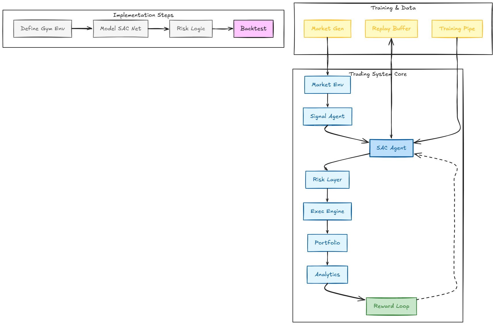

# agentic-trader
# Agentic Trading AI

A reinforcement learning trading research platform designed to explore adaptive decision-making, risk-aware execution, and modular trading system architecture.

The project combines synthetic market simulation, reinforcement learning, risk management, and portfolio analytics into a unified experimentation environment.

---

## Project Overview

Traditional trading systems often rely on fixed rules and predefined indicators.

This project explores whether reinforcement learning can be used to build adaptive trading systems capable of learning trading behaviour through experience rather than hardcoded decision rules.

The system was designed as a research platform for studying:

* Reinforcement Learning in financial markets
* Reward engineering
* Synthetic market generation
* Risk-aware trade execution
* Agent behaviour under uncertainty
* Trading system architecture

---

## Architecture

### System Architecture Diagram

The architecture separates training infrastructure from trading execution components.

Core modules include:

* Market Environment
* Feature Engineering Engine
* SAC Agent
* Risk Management Layer
* Trade Execution Engine
* Portfolio Manager
* Analytics Engine
* Reward Engine
* Replay Buffer
* Training Pipeline

This modular design improves:

* Debuggability
* Extensibility
* Research iteration speed
* Future deployment flexibility

---

## Training Infrastructure

### Market Generation

The system generates synthetic market conditions including:

* Trend Up
* Trend Down
* Range
* Breakout
* Volatility Spike
* Liquidity Drought
* Flash Crash

These regimes allow controlled experimentation and agent evaluation under different market behaviours.

### Reinforcement Learning

Algorithm:

* Soft Actor-Critic (SAC)

Training Configuration:

* Hidden Units: 256
* Replay Buffer: 1,000,000 Experiences
* Batch Size: 256
* Observation Features: 29
* Episode Length: 2,000 Steps

---

## Training Results

### Training Screenshot

Training metrics observed during experimentation:

* 5,000+ Episodes
* 1,000,000+ Simulated Candles
* Peak Win Rate: 68.7%
* Maximum Drawdown: ~3%
* Stable Trade Activity
* Successful Reward Optimization

---

## Key Features

### Reinforcement Learning Agent

* Soft Actor-Critic (SAC)
* Continuous policy optimization
* Experience replay learning

### Risk Management

* Position sizing controls
* Drawdown management
* Risk allocation constraints

### Portfolio Monitoring

* Performance tracking
* Win-rate monitoring
* Balance monitoring
* Return analysis

### Reward Engineering

Designed reward structures to encourage:

* Profitable trading
* Controlled risk exposure
* Consistent participation
* Long-term optimization

---

## Technical Challenges

### Policy Collapse

One of the largest challenges was preventing the agent from learning to avoid trading entirely.

A "never trade" policy produces low losses but also prevents profit generation.

Reward structures were redesigned to ensure participation carried measurable value.

### Reward Engineering

Creating rewards that encouraged profitability without allowing exploitative behaviours required extensive experimentation and validation.

### Synthetic Market Design

Market simulations needed enough structure for learning while avoiding unrealistic bias or information leakage.

### Exploration vs Exploitation

Balancing exploration and exploitation remained a central challenge throughout training.

---

## Technology Stack

### Core Development

* Python
* NumPy
* Pandas

### Machine Learning

* PyTorch
* Soft Actor-Critic (SAC)

### Statistical Analysis

* SciPy
* Custom validation pipelines

### System Design

* Multi-agent architecture
* Event-driven processing
* Modular risk management

---

## Key Learnings

Building profitable AI systems is often more dependent on environment design and reward engineering than model selection.

A significant portion of development focused on:

* Creating learnable environments
* Preventing reward exploitation
* Measuring agent behaviour
* Improving training stability

The project reinforced the importance of systems thinking when building reinforcement learning applications.

---

## Future Improvements

Planned improvements include:

* Real market data integration
* Advanced portfolio optimization
* Multi-agent collaboration
* Enhanced analytics dashboards
* Distributed training infrastructure
* Live paper-trading deployment

---

## Author

Moss Victor

Frontend Engineer Building AI-Driven Systems & Trading Infrastructure
